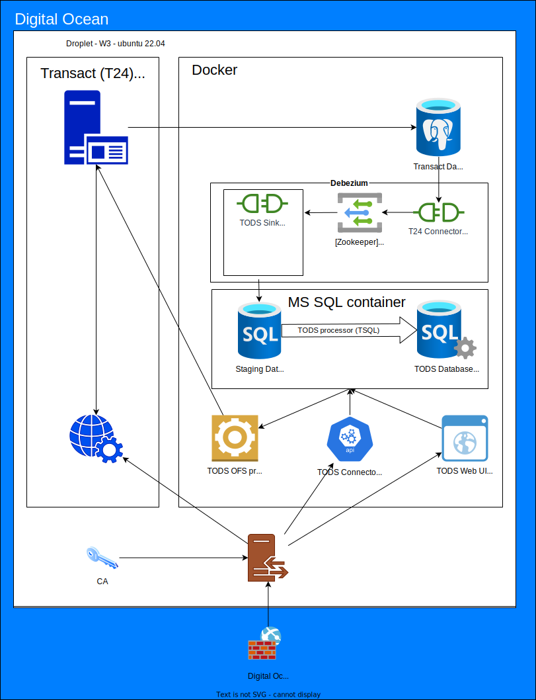
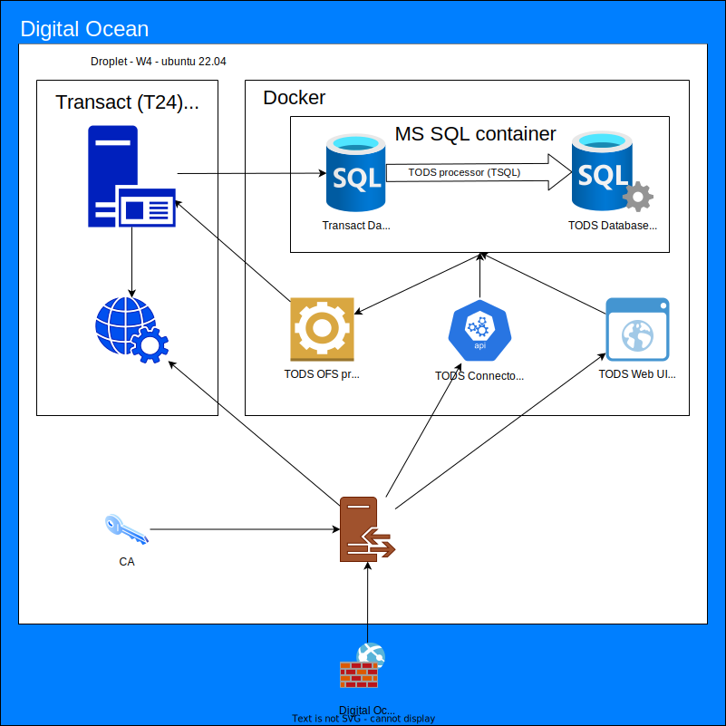

# Draw.io Demo

## How to embed drawio diagrams
- https://github.com/philip-gai/github-drawio-demo?tab=readme-ov-file
- https://github.com/hediet/vscode-drawio#readme

# Samples

Below are sample diagrams for public demonstration.
TODS (Transact Operational Data Source) is a Minimum Viable Product currently under development.

## TODS data processing

## TODS environment W3

## TODS environment W4

